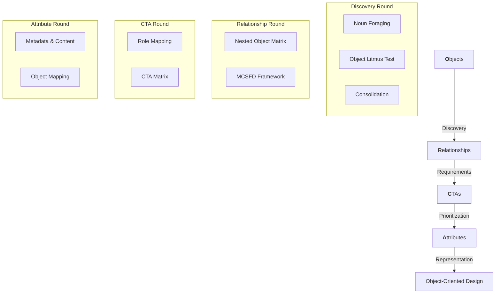

# 🐋 OOUX Facilitator Skill

An AI agent skill that actively facilitates [Object-Oriented UX (OOUX)](https://ooux.com) sessions — guiding you through Sophia Prater's ORCA process step by step.

Instead of just explaining the methodology, this skill turns your AI agent into a workshop facilitator: it asks questions, synthesizes your answers into structured artifacts, challenges assumptions, and coaches you through each round of ORCA.

## 🚀 Install

```bash
npx skills add s1dd4rth/ooux-skill
```

*Works with Claude Code, Cursor, Windsurf, Cline, Copilot, and [19 other agents](https://skills.sh).*

## 🧠 The ORCA Process

The skill guides you through the **ORCA process** — a 15-step framework for structuring digital products around objects (the nouns in your system) before designing screens or flows.



## ✨ Features

- **Coached Facilitation:** The agent doesn't just "do" OOUX; it coaches you through it, asking questions and challenging assumptions.
- **Artifact Generation:** Automatically produces formatted Object Maps, CTA Matrices, and Nested Object Matrices.
- **Three Engagement Modes:**
    - **Quick ORCA (~20 min):** For rapid brainstorming and initial object mapping.
    - **Working ORCA (~60 min):** For scoped, prioritized system architecture.
    - **Full ORCA (Multi-session):** For rigorous, production-ready product design.

## 🛠️ How to Use

Simply tell your agent what you're working on. You can start with a fresh idea or feed it existing materials:

- *"Help me structure a fitness tracking app using OOUX."*
- *"Run a noun foraging session on this PRD: [link or paste text]"*
- *"I have a messy database schema. Can we audit it for broken objects?"*

The facilitator will intake your context and suggest the best starting point in the ORCA process.

## 📂 Skill Structure

```
ooux-skill/
├── SKILL.md                          # Core facilitator logic & prompt design
├── ooux.skill                        # Compiled skill definition
└── references/
    ├── object-discovery.md           # Noun foraging & Litmus Test techniques
    └── artifact-templates.md         # Templates for all ORCA deliverables
```

## 📜 Attribution

**OOUX and the ORCA Process** were created by **[Sophia V. Prater](https://ooux.com)**, founder of Rewired and chief evangelist of Object-Oriented UX. 

This skill is an independent implementation guide designed for AI agents and is not an official OOUX product. To learn the full methodology and get certified, visit **[ooux.com](https://ooux.com)**.

## ⚖️ License

MIT
